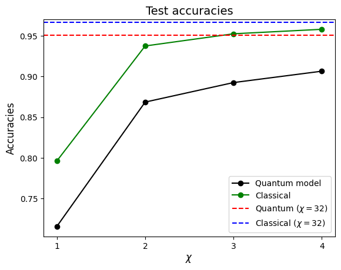

# Quantum Image Classification with MPS

This repository presents a simple quantum classifier designed to assess the encoding capabilities of Matrix Product States (MPS) for images. The widely recognized MNIST dataset is employed for binary classification. Utilizing $\log_2(L\times L)$ qubits for $L\times L$ images, we encode images into the amplitudes of a quantum state, allowing for approximations with varying bond dimensions.

## Model Overview

The variational model incorporates a single classification qubit with controlled rotations. These rotations are controlled by the encoding qubits and contain the trainable parameters. Upon measurement of the classification qubit, the corresponding label is based on fidelity with respect to the $|0\rangle$ state. The model is trained to rotate images of class 0 towards the $|0\rangle$ state and images of class 1 towards the $|1\rangle$ state.

Where:\
$\bullet |z\rangle =$ image from left to right and up to down\
$\bullet |W\rangle =$ image from up to down and left to right

For the MNIST dataset, $L=28$ so $q=10$ loading qubits.

# Conclusions

We evaluated the performance of the model across various compression values ($\chi$) while focusing on a single layer. In the classical model, we opted for a logistic regression model, utilizing the states $|\tilde{\psi}\rangle$ as the input.

The model is not complex enough, as its performance, even without compression of the images, is below to a simple classical classifier. Nonetheless, it serves as a tool to evaluate the impact of bond dimension on classification accuracy. Additionally, the employment of controlled rotations, controlled by the loading qubits, proves effective as a variational model.
